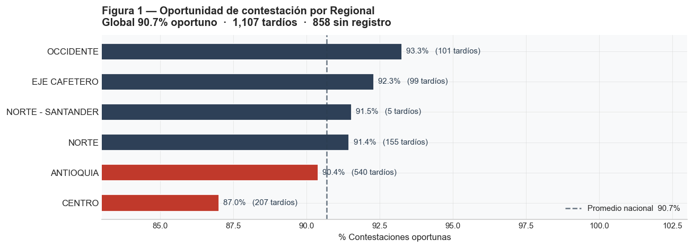
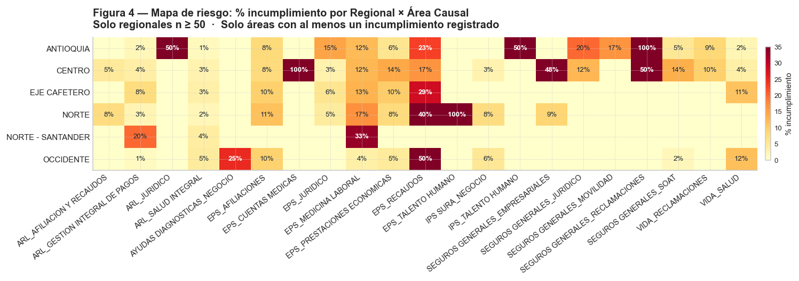

# Gestión de Tutelas 2026
### Informe Ejecutivo · Analítica Legal — SURA
*Período: enero – abril 2026 · Corte: 12 mayo 2026 · 12,726 registros analizados*

---

## La operación responde, pero sin margen

Cada tutela que llega a SURA activa un contador. La ley da 48 horas para contestar, y el equipo llega: el **90.7 %** de los expedientes se responden a tiempo. Es un buen número. Pero la mediana real de respuesta es **53 horas** — justo por encima del límite —, lo que significa que la mayoría de los cumplimientos son ajustados, no holgados. Cualquier incremento sostenido en el volumen o complejidad de los casos los convertiría en incumplimientos.

El rezago tampoco se distribuye igual en todo el país. La regional **CENTRO** acumula la tasa más baja (87 % oportuno) mientras que **ANTIOQUIA**, aunque más cerca del promedio, concentra el mayor número absoluto de tardíos. Hay además un punto caliente que no aparece en los reportes de volumen: el cruce entre CENTRO y la línea de Seguros Empresariales tiene casi la mitad de sus expedientes fuera de plazo.

El proceso interno es eficiente — desde que llega la notificación hasta que el abogado contesta pasan en mediana 2 días. El verdadero cuello de botella está después del fallo de primera instancia: la notificación de segunda instancia tarda en promedio **31 días** en llegar. Es tiempo judicial, fuera del control directo de la organización, pero hay ventana suficiente para preparar impugnaciones si existe un seguimiento activo.

---

## Lo que el volumen no muestra

La tasa de oportunidad describe qué tan rápido se responde. Pero hay otra pregunta igual de importante: ¿qué tan bien se está ganando? La favorabilidad global en primera instancia es del **51 %**. Uno de cada dos fallos sale en contra de SURA.

El número varía mucho según el área: las tutelas de ARL y Vida tienen favorabilidad por encima del 75 %, mientras que las de **EPS Prestaciones Económicas** bajan al 42 %. En más de mil casos anuales, la organización está perdiendo sistemáticamente. Eso no es mala suerte — es una señal de que la estrategia argumentativa en esa materia necesita revisión.

El mapa de calor siguiente cruza regional con área causal para mostrar dónde se concentra la exposición real:

Sobre los expedientes activos se construyó un **score de criticidad** que combina tres señales: ausencia de contestación, fallo desfavorable vigente y medida provisional activa. El resultado: **1,110 casos — el 10 % del portafolio activo** — concentran riesgo simultáneo en más de un frente. La lista está disponible ordenada por score para asignación directa.

---

## Qué hacer y cómo evitar repetirlo

Las acciones más urgentes son claras. Primero, revisar los **858 expedientes que no tienen contestación registrada** — pueden ser omisiones de registro o incumplimientos reales, pero en ambos casos el expediente está desprotegido. Segundo, trabajar los 1,110 casos críticos con la lista priorizada. Tercero, reforzar el seguimiento en CENTRO × Seguros Empresariales antes de que la situación escale.

En el mediano plazo, la mejora de mayor impacto es simple: una alerta automática cuando un expediente lleve **40 horas sin contestación**. Eso deja 8 horas reales de margen antes del vencimiento legal — suficiente para actuar. Hoy esa alerta no existe.

Más allá de los casos urgentes, hay un problema de fondo que limita cualquier análisis futuro: el campo *Área causal* está vacío en más de la mitad de los expedientes de EPS. Sin ese dato no es posible comparar el desempeño entre líneas de negocio ni identificar patrones jurisprudenciales. Resolverlo en el sistema de radicación es prerequisito para todo lo demás.

La visión a mediano plazo es convertir este tipo de análisis — hoy construido manualmente — en un proceso automático: extracción diaria de datos, recálculo del score de criticidad, generación del informe y distribución al equipo. El código desarrollado en este proyecto puede ser la base de ese pipeline.

---

*Análisis completo: `outputs/informe_tutelas_2026.html` · Lista de casos críticos: `outputs/casos_criticos_priorizados.csv`*
