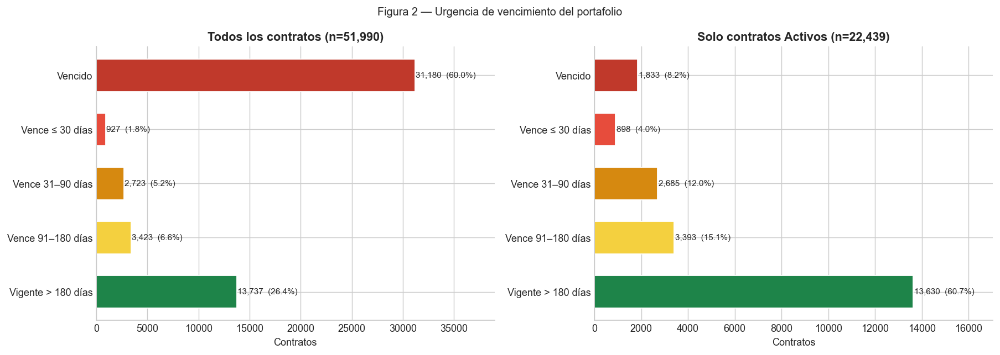
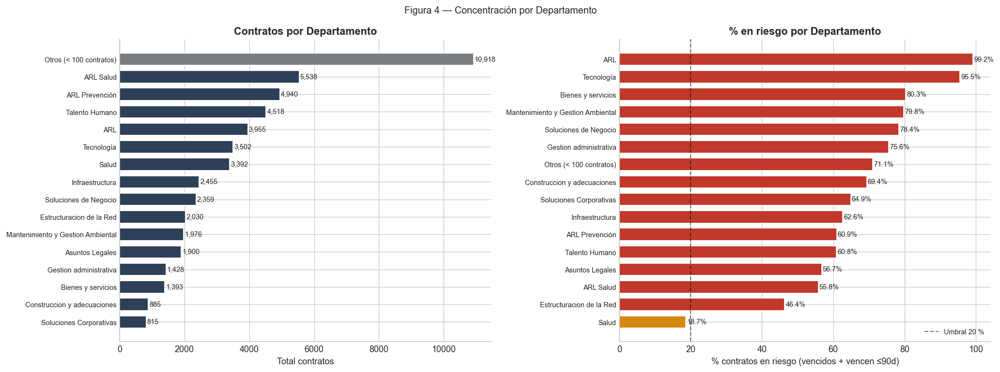

# Portafolio Contractual 2026
### Informe Ejecutivo · Analítica Legal — SURA
*Corte: 11 mayo 2026 · 52,004 contratos analizados · Fuente: sistema de gestión contractual*

---

## El portafolio responde, pero con contratos que vencen en silencio

De los 52,004 contratos en el sistema, el 43,2% se encuentran activos a la fecha de corte. La cifra no genera alarma por sí sola. Lo que sí la genera es que dentro de ese bloque activo conviven 1,833 contratos cuya fecha de expiración ya pasó y siguen marcados como vigentes en el sistema: no hay renovación registrada, no hay cierre, solo silencio administrativo. A estos se suman 898 contratos activos que vencen en los próximos 30 días y 2,685 adicionales que lo harán antes del mes de agosto. En total, 3,583 contratos activos —uno de cada seis— requieren una decisión antes de 90 días.

La distribución mensual de vencimientos proyecta que los meses más críticos del año son mayo–julio 2026 (ya en curso) y diciembre 2026–enero 2027, donde se concentra un pico de más de 2,200 vencimientos mensuales. Sin monitoreo activo, ese pico llegará sin notificación al equipo legal.

---

## Dónde se concentra el riesgo — y lo que la cifra global oculta

El riesgo no está distribuido uniformemente. Cuando se mide el porcentaje de contratos en riesgo por departamento (vencidos o próximos a vencer en 90 días), ARL aparece con un 99,2% y Tecnología con un 95,5%. ARL Salud y ARL Prevención, los dos departamentos con mayor volumen del portafolio (5,538 y 4,940 contratos respectivamente), superan el 55% de contratos en riesgo. Talento Humano, con 4,518 contratos, tampoco escapa: aparece entre los cinco departamentos con mayor número de contratos en la lista de atención prioritaria.

El tipo de contrato dominante es Prestación de Servicios (11,066 contratos, el 21% del total). El proveedor con mayor concentración acumula 624 contratos; los diez primeros proveedores representan más de 4,400 contratos activos. Esa concentración en pocos terceros hace que el vencimiento desatendido de uno de ellos pueda interrumpir servicios simultáneamente en múltiples unidades de negocio.

---

## Qué hacer y cómo no volver a descubrirlo tarde

**Atención inmediata.** Los 1,833 contratos activos con fecha ya vencida deben revisarse esta semana para determinar si se renovaron tácitamente, si debe iniciarse cierre formal o si corresponde actualizar el estado en sistema. Los 898 contratos que vencen en los próximos 30 días requieren decisión urgente de renovación o terminación.

**Dato base.** Hay 3,230 contratos sin administrador asignado (6,2% del total) y 883 con fecha de inicio posterior a la de expiración, lo que indica que los campos no fueron validados al ingresar. Antes de automatizar alertas, estos registros deben corregirse: una alerta sobre un contrato sin administrador asignado no llegará a nadie.

**Propuesta de automatización.** Tres mecanismos de control pueden implementarse con los datos ya disponibles: (1) alerta automática a 90 y 30 días antes del vencimiento, dirigida al administrador del contrato y a su responsable de área; (2) reporte semanal de contratos activos con fecha ya vencida para depuración continua del estado; (3) validación en el momento de registro que impida guardar contratos con fecha inicio > fecha expiración o sin administrador asignado. Los indicadores a monitorear de forma permanente son: % activos en riesgo ≤90 días, % contratos sin administrador, tasa de inconsistencias de fecha y volumen de vencimientos proyectado mes a mes.

---
*Análisis completo: `outputs/informe_contratos_2026.html` · Lista de contratos críticos: `outputs/contratos_criticos_90dias.csv`*